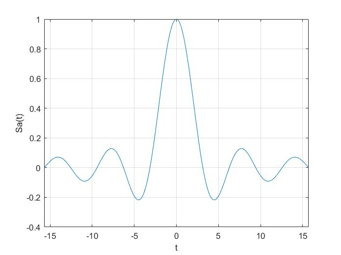

# 信号

**********

## 信号的分类
* **连续信号和离散信号**
* **周期信号和非周期信号：**
周期信号不一定有最小周期，例如：$f(t)=A$
* **能量信号和功率信号：**
一个信号如果不是能量信号可能是功率信号，但是如果一个信号既不是能量信号也不是功率信号那么这个信号是**功率无限信号**
例如：$f(t)=e^t$
* **确定信号和随机信号：**
确定信号：能给出确定的$f(t)$的表达式
随机信号：只能知道信号可能的取值，具体的取值不确定

******

## 典型的信号
* **指数信号：**
$$f(t)=Ke^{-at}\quad t>0$$
* **正弦信号：**
$$f(t)=Ksin(\omega t+\theta)$$
* **复指数信号：**
$$f(t)=Ke^{(\sigma+j\omega)t}=Ke^{\sigma t}cos(\omega t)+jKe^{\sigma t}sin(\omega t)$$
* **抽样信号：**
$$Sa(t)=\frac{sin(t)}{t}$$

$$\int_{-\infty}^{+\infty}Sa(t)dt=\pi$$

$$sinc(t)=Sa(\pi t)=\frac{sin(\pi t)}{\pi t}$$

*********

## 信号的运算
* **移位、反褶、尺度变换**
移位：$f(t)\rightarrow f(t\pm t_0)$，左加右减
反褶：$f(t)\rightarrow f(-t)$
尺度变换：$f(t)\rightarrow f(at)$
* **微分、积分**
注意：跳变点微分之后会出现冲击，微分和积分不具有可逆性。
$$\frac{d}{dt}\left[\int_{-\infty}^tf(\tau)d\tau\right]=f(t) \quad \int_{-\infty}^t\left[\frac{d}{d\tau}f(\tau)\right]d\tau\neq f(t)$$

* **相乘、相加**
注意：信号相乘或相加就是对应点相乘或相加。