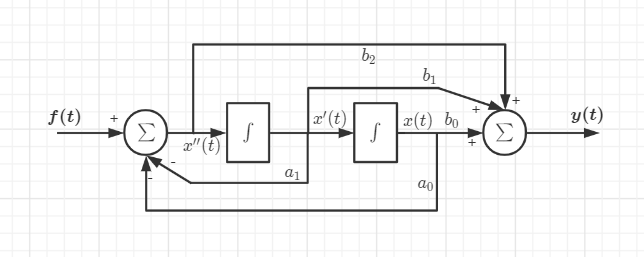

# 系统模型及分类
* **线性时不变系统**
* **系统模型及微分方程**

***

## 线性时不变系统

### 系统的分类
* 连续时间系统与离散时间系统
* 线性系统与非线性系统
* 时变系统与时不变系统
* 可逆系统与不可逆系统
* 因果系统与非因果系统

### 叠加性与均匀性
**规则：线系统后叠加 $\substack{?\\=}$ 先叠加后系统**

    

$$r(t)=f[e(t)]$$

先系统后叠加：$a_1f[e_1(t)]+a_2f[e_2(t)]$
先叠加后系统：$f[a_1e_1(t)+a_2e_2(t)]$
判断：$f[a_1e_1(t)+a_2e_2(t)]\substack{?\\=}a_1f[e_1(t)]+a_2f[e_2(t)]$
典型非线性系统：$r(t)=e^2(t) \qquad r(t)=e(t)+A$

### 时不变特性
**规则：线系统后延时 $\substack{?\\=}$ 先延时后系统**

    

$$r(t)=f[e(t)]$$

先系统后延时：$r(t-t_0)$
先延时后系统：$f[e(t-t_0)]$
判断：$r(t-t_0)\substack{?\\=}f[e(t-t_0)]$
典型时变系统：$r(t)=te(t) \quad r(t)=t+e(t) \quad r(t)=e(at),a\neq1$

### 因果性
**规则：输出与未来的输入值无关**
典型非因果系统：$r(t)=e(-t) \qquad r(t)=e(2t)$
注意：$r(t)=cos(t+5)e(t)$为因果

### 即时性（动态性）
**规则：当前输出仅仅与当前输入有关**
典型动态系统：微积分系统，非因果系统

### 微分特性
**规则：输入微分则输出也微分**

### 可逆系统
**规则：不存在多个输入对应一个输出**

******

## 系统模型与微分方程

### 由系统框图建立微分方程
**直接建立方程**

    

$$r(t)=b_1e(t)-a_0\int r(\tau)d\tau$$

**性质：输入倍乘与输出倍乘等价。**

    

$$i(t)=\int \frac{1}{L}e(\tau)d\tau-\int \frac{R}{L}i(\tau)d\tau-\frac{1}{LC}\int\int i(\tau)d\tau$$

**间接建立方程**

    

$$\begin{align*}
    左侧：
    & x''(t)=f(t)-a_0x(t)-a_1x'(t) \\
    & f(t)=x''(t)+a_1x'(t)+a_0x(t)
\end{align*}$$

$$右侧：y(t)=b_2x''(t)+b_1x'(t)+b_0x(t)$$

$$合并：\left\{
\begin{align*}
    & y''(t)=b_2[x''(t)]''+b_1[x'(t)]''+b_0x''(t) \\
    & a_1y'(t)=b_2a_1[x''(t)]'+b_1a_1[x'(t)]'+b_0a_1x'(t) \\
    & a_0y(t)=b_2a_0x''(t)+b_1a_0x'(t)+b_0a_0x(t)
\end{align*}
\right.$$

$$y''(t)+a_1y'(t)+a_0y(t)=b_2f''(t)+b_1f'(t)+b_0f(t)$$

**方法二：利用线性时不变系统的叠加性**